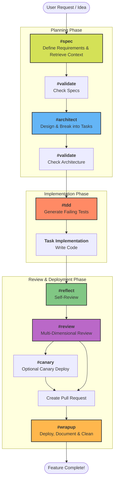
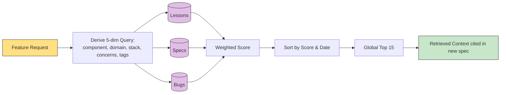
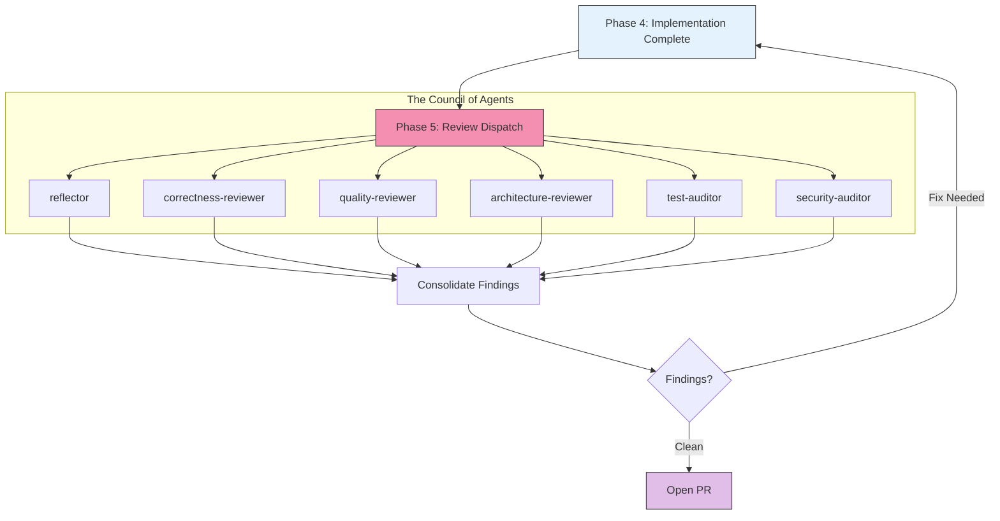
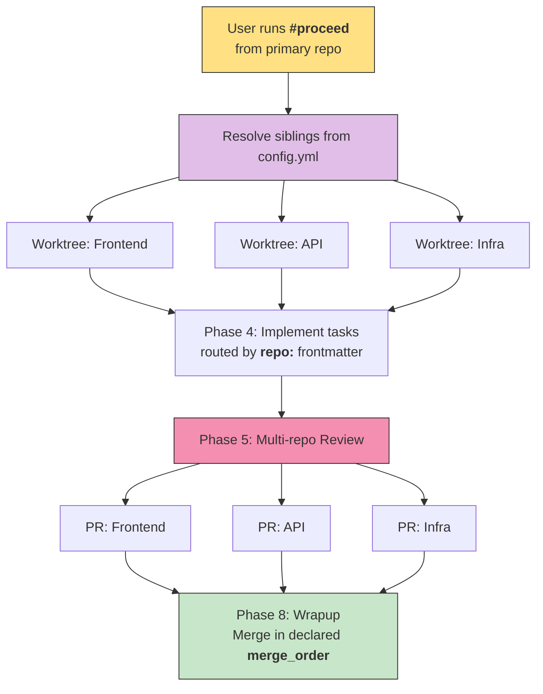
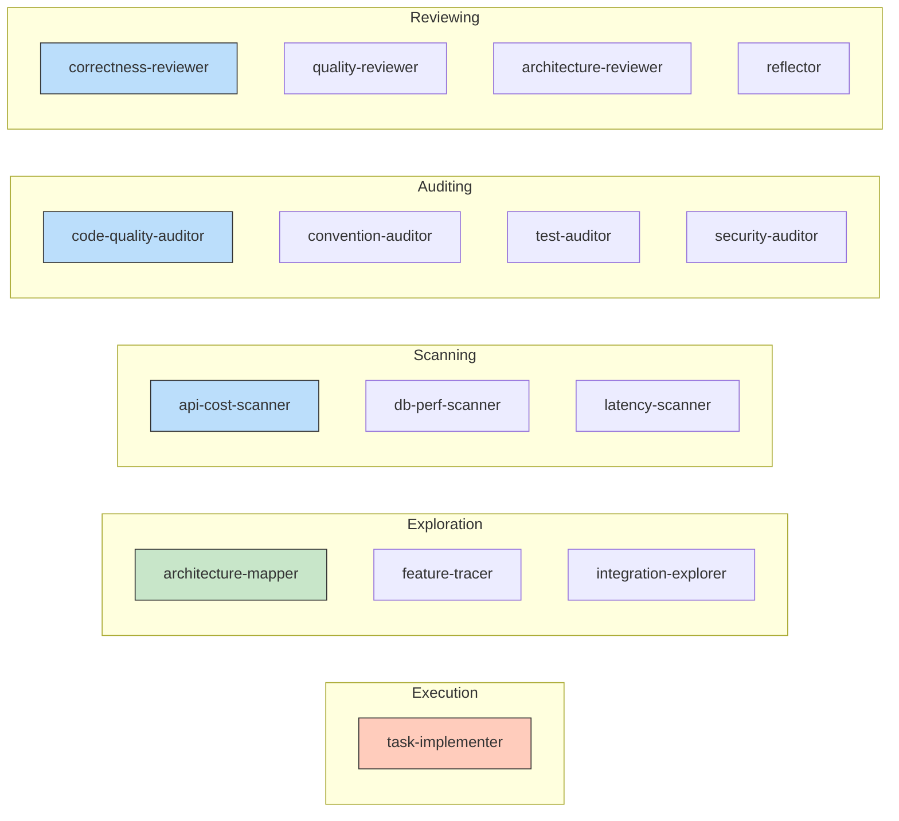

# Copilot Forge: Complete Flow & Architecture Overview

Welcome to the **Copilot Forge** demo guide! This document breaks down the entire project into simple terms so you can easily understand and demonstrate how it enables **Spec-Driven Development** with GitHub Copilot.

---

## 🌟 What is Copilot Forge?

At its core, Copilot Forge is a structured framework that guides GitHub Copilot through a disciplined software development lifecycle. Instead of treating AI as a simple autocomplete tool, Copilot Forge turns it into a structured pipeline.

It uses a **Spec-Driven Pipeline**: You don't just ask the AI to write code. First, you define the spec, then the architecture, then tests, then implementation, and finally review and deployment. 

---

## 🔄 The Complete Flow

Here is the end-to-end journey of a feature built using Copilot Forge. You can run these steps manually or orchestrate them automatically using the `#proceed` command.



### Flow Breakdown:
1. **Planning**: `#spec` gathers requirements, `#architect` breaks them into technical tasks.
   > **The Double Validation Gate:** `#validate` appears twice because two different artifacts get gated: the spec *(does the requirement express what we actually want?)* and the architecture *(do the tasks cover the spec, with correct dependencies and repo routing?)*. Both gates are hard — a failing validation loops back, it does not proceed.
2. **Implementation**: `#tdd` writes tests first (Red-Green-Refactor), followed by actual coding.
3. **Review**: `#reflect` ensures the code matches the tasks, `#review` brings in "specialized agents" to audit code quality, correctness, architecture, tests, and security.
4. **Wrap-up**: After tests pass and PRs merge, `#wrapup` commits changes, generates docs, and cleans up.

---

## 🧠 Advanced Capabilities (The "Production-Grade" Features)

To truly demonstrate the power of Copilot Forge, highlight these advanced architectural decisions that elevate it from a basic demo to a production-ready framework.

### 1. The Autonomy Contract & Technical Backend
By default, AI tries to ask for permission at every step, turning automation into a chore. Copilot Forge operates on an **Autonomy Contract**. It is a shift from **Event-Driven AI** (wait for user input) to **State-Machine AI** (run until the goal is achieved).

**How it works under the hood:**
*   **The State Machine (`pipeline-state.json`)**: This file lives inside each requirement's folder and tracks the `currentPhase` and `completedPhases`. It acts as the durable memory of the feature.
*   **The Orchestrator (`#proceed`)**: The agent reads the state file, identifies the "Incomplete" tasks, and enters a recursive execution loop. It automatically triggers `#spec`, `#architect`, `#tdd`, etc., without pausing to ask for permission for each transition.
*   **Logging vs. Interrupting**: The AI treats success as a **background log event** (e.g., appending "Tests passed" to the log) and only treats failure as a **foreground interrupt event**.
*   **Halt Conditions**: The contract only pauses at specific, declared "Hard Halts":
    1. **Validation Failure**: The `#validate` agent returns a `FAIL`.
    2. **Escalations**: The AI encounters an ambiguity it cannot resolve.
    3. **Canary Failure**: Automated tests fail after three attempts.
    4. **Merge Conflicts**: In cross-repo mode, a worktree cannot be rebased automatically.

### 2. The Triple Context Strategy & Technical Wiring
What makes Forge accurate is how it "wires" the AI. When a command like `#proceed` is run, the AI merges three distinct data streams to form its prompt:
1. **Global Rules**: The project's culture, tech stack, and standards (from `copilot-instructions.md`).
2. **Specialized Agents**: The specific job description and constraints for the current phase (e.g., `security-auditor.md` from `.github/prompts/agents/`).
3. **Local State**: The live, durable memory of the current feature (`pipeline-state.json`).

**The Wiring (Read-Observe-Act):**
Every prompt is hard-coded to begin with an `Observe` step using the `codebase` tool to read `pipeline-state.json`. The AI reads the `currentPhase` value, which acts as its **Instruction Pointer**. It then strictly executes the logic mapped to that phase. It is forbidden from transitioning to the next phase until it performs an atomic write back to the JSON file, ensuring state is never lost.

### 3. Context Retrieval (Organizational Memory)
When `#spec` is invoked, it doesn't just write a requirement from scratch. It acts as a **Retriever**, pulling prior context from the `.forge/knowledge/` corpus. This ensures that mistakes aren't repeated and cross-cutting concerns are baked into the new spec automatically.



### 4. Agent Constraints & The Phase 5 Deep Dive
During the `#review` phase (Phase 5 of `#proceed`), Copilot dispatches specialized "Auditor" and "Reviewer" agents. Crucially, **reviewers act under constraints.** They audit the code against conventions and security rules but do not implement the features. Only the "Implementer" agent is responsible for writing the production code. 

**Deep Dive: The Phase 5 Consolidation Flow**


### 5. Cross-Repo Coordination
Copilot Forge can coordinate a single requirement that touches multiple repositories (e.g., frontend, backend API, infrastructure). 
* **Primary per-REQ:** Whichever repo originates the REQ becomes the "primary" and holds the spec.
* **Worktree Fan-out:** The pipeline creates parallel Git worktrees in all sibling repositories.
* **Orchestrated Merge:** During `#wrapup`, PRs are merged in a strict, predefined `merge_order` to prevent breaking changes.



### 6. Multi-REQ Orchestration (`#sprint`)
For bulk work, the `#sprint` command orchestrates multiple `#proceed` pipelines. Copilot Forge manages atomic REQ counters and isolated worktrees for each feature, ensuring that multiple features can be developed concurrently without Git state collisions.

---

## 🛠️ The Moving Parts: Skills vs Agents vs Templates

To make this flow work, Copilot Forge relies on three main components. Think of it like a real-world software company:

### 1. Skills (The Workflows / Commands)
Skills are the main entry points you type in Copilot Chat (`#<skill>`). They are located in the root of `.github/prompts/`. They dictate the *process* and tell Copilot what phase of the pipeline we are in.

* **Core Pipeline**: `#spec`, `#architect`, `#tdd`, `#reflect`, `#review`, `#wrapup`
* **Orchestrators**: `#proceed` (runs a single feature end-to-end), `#sprint` (runs multiple features).
* **Maintenance & Audit**: `#analyze`, `#optimize`, `#security_scan`.
* **Other Utilities**: `#init`, `#bugfix`.

### 2. Agents (The Specialized Personas)
Agents are specialized reference checklists located inside `.github/prompts/agents/`. 
They **do not run on their own**. Instead, they get "hired" by the Skills. For example, when the `#review` Skill runs, it dynamically instructs Copilot to adopt the `security-auditor.md` persona. Breaking them out into a subfolder keeps the master prompts clean and prevents context pollution.

### 3. Templates (The Blank Forms)
Templates are located in the `templates/` directory (and copied to `.forge/templates/`). 
They contain **zero logic**. They are simply Markdown structures with placeholders (e.g., `task-template.md`). The Skills use these templates to "stamp out" consistent artifacts, ensuring every requirement and task looks identical across the entire project.

**The Relationship:** When you run a **Skill** (`#review`), it adopts an **Agent** persona (`security-auditor`), and if it needs to write a report, it uses a **Template** to format it!

**The Agent Roster & Groupings:**


---

## 📦 Artifacts & Directory Structure

Every artifact lives in the `.forge/` directory under the project root. This separation is load-bearing: the **process** (skills, agents, logic) is pulled from the toolkit repository, while the **artifacts** accumulate locally as the permanent memory of each project.

```text
.forge/
  config.yml         # Cross-repo configuration, tech stack, and deployment targets (optional)
  context/           # Project architecture, conventions, variables, and overview
  specs/             # Requirement docs (REQs), architecture docs, and task files
  knowledge/         # Validated assumptions, lessons learned, and support FAQs
  templates/         # Project-local copies of the toolkit templates
```

### Breakdown of the Directories:

* **`config.yml`:** The master configuration file. It dictates the stack (e.g., Spring Boot, React), cloud targets, and cross-repo links. Nothing is hardcoded in the prompts; they all read this file at runtime.
* **`context/`:** Keeps living documents of how the system is built (like `architecture.md` and `variables.md`). It is automatically updated via the `#analyze` tool to resolve documentation drift.
* **`specs/`:** Holds the feature specifications (`REQ-*.md`) generated by `#spec`, and the step-by-step coding instructions (`tasks/`) generated by `#architect`.
* **`knowledge/`:** The organizational memory used for Context Retrieval. It stores `LESSON-*.md`, `ASSUMPTION-*.md`, and `SUPPORT-*.md`.
* **`templates/`:** Standardized markdown templates used by Copilot to generate all the above artifacts consistently.

## 🚀 Summary for Demos

When demonstrating Copilot Forge, emphasize that **it turns AI from an autocomplete gimmick into a disciplined engineering partner.** 

1. Show how `#init` scaffolds the project and `.forge/` directory.
2. Run `#spec` and highlight how it **retrieves prior context** from `.forge/knowledge/` so it doesn't make past mistakes.
3. Show `#architect` breaking requirements into concrete tasks across **multiple repositories** inside `.forge/specs/tasks/`.
4. Explain the **Autonomy Contract**: It runs end-to-end and only halts for validation failures or conflicts.
5. Highlight the **Agent constraints**: Security and architecture reviewers are separated from implementers to ensure unbiased auditing.
