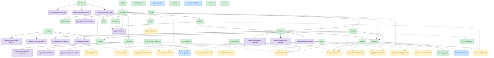

# Copilot Forge Dependency Graph

Auto-generated by \scripts/generate-graph.ps1\.

```mermaid
graph TD
    analyze("#analyze") --> agents/code_quality_auditor("#agents/code-quality-auditor")
    analyze("#analyze") --> agents/convention_auditor("#agents/convention-auditor")
    analyze("#analyze") --> agents/security_auditor("#agents/security-auditor")
    analyze("#analyze") --> agents/test_auditor("#agents/test-auditor")
    architect("#architect") --> agents/architecture_mapper("#agents/architecture-mapper")
    architect("#architect") --> agents/feature_tracer("#agents/feature-tracer")
    architect("#architect") --> agents/integration_explorer("#agents/integration-explorer")
    architect("#architect") -.-> adr_template_md("adr-template.md")
    architect("#architect") -.-> forge_gate_ps1("forge-gate.ps1")
    architect("#architect") -.-> task_template_md("task-template.md")
    bugfix("#bugfix") --> canary("#canary")
    bugfix("#bugfix") --> wrapup("#wrapup")
    bugfix("#bugfix") -.-> bug_template_md("bug-template.md")
    bugfix("#bugfix") -.-> lesson_template_md("lesson-template.md")
    check_drift("#check-drift")
    forge_admin("#forge-admin") -.-> forge_gate_ps1("forge-gate.ps1")
    init("#init") -.-> adr_template_md("adr-template.md")
    init("#init") -.-> assumption_template_md("assumption-template.md")
    init("#init") -.-> bug_template_md("bug-template.md")
    init("#init") -.-> deployment_template_md("deployment-template.md")
    init("#init") -.-> env_local_template_env("env-local-template.env")
    init("#init") -.-> lesson_template_md("lesson-template.md")
    init("#init") -.-> requirement_template_md("requirement-template.md")
    init("#init") -.-> support_template_md("support-template.md")
    init("#init") -.-> task_template_md("task-template.md")
    init("#init") -.-> taxonomy_template_md("taxonomy-template.md")
    init("#init") -.- variables_template_md("variables-template.md")
    init("#init") -.- inbox_template_md("inbox-template.md")
    issue_epic_creation("#issue_epic_creation") -.-> env_local_template_env("env-local-template.env")
    optimize("#optimize") --> agents/api_cost_scanner("#agents/api-cost-scanner")
    optimize("#optimize") --> agents/db_perf_scanner("#agents/db-perf-scanner")
    optimize("#optimize") --> agents/latency_scanner("#agents/latency-scanner")
    proceed("#proceed") --> agents/reflector("#agents/reflector")
    proceed("#proceed") --> agents/task_implementer("#agents/task-implementer")
    proceed("#proceed") --> architect("#architect")
    proceed("#proceed") --> canary("#canary")
    proceed("#proceed") --> check_drift("#check-drift")
    proceed("#proceed") --> reflect("#reflect")
    proceed("#proceed") --> review("#review")
    proceed("#proceed") --> tdd("#tdd")
    proceed("#proceed") --> validate("#validate")
    proceed("#proceed") --> wrapup("#wrapup")
    proceed("#proceed") -.-> forge_gate_ps1("forge-gate.ps1")
    query("#query") -.-> adr_template_md("adr-template.md")
    query("#query") -.-> assumption_template_md("assumption-template.md")
    query("#query") -.-> lesson_template_md("lesson-template.md")
    query("#query") -.-> manual_qa_template_md("manual-qa-template.md")
    query("#query") -.-> support_template_md("support-template.md")
    reflect("#reflect") --> agents/reflector("#agents/reflector")
    reflect("#reflect") --> review("#review")
    reflect("#reflect") -.- inbox_template_md("inbox-template.md")
    review("#review") --> agents/architecture_reviewer("#agents/architecture-reviewer")
    review("#review") --> agents/correctness_reviewer("#agents/correctness-reviewer")
    review("#review") --> agents/quality_reviewer("#agents/quality-reviewer")
    review("#review") --> agents/security_auditor("#agents/security-auditor")
    review("#review") --> agents/test_auditor("#agents/test-auditor")
    review("#review") --> wrapup("#wrapup")
    review("#review") -.- inbox_template_md("inbox-template.md")
    spec("#spec") --> validate("#validate")
    spec("#spec") --> vibe("#vibe")
    spec("#spec") -.-> requirement_template_md("requirement-template.md")
    sprint("#sprint") --> proceed("#proceed")
    token_estimate("#token-estimate") -.-> token_estimate_ps1("token-estimate.ps1")
    vibe("#vibe") -.-> vibe_template_md("vibe-template.md")
    wrapup("#wrapup") --> security_scan("#security_scan")
    wrapup("#wrapup") -.-> adr_template_md("adr-template.md")
    wrapup("#wrapup") -.-> assumption_template_md("assumption-template.md")
    wrapup("#wrapup") -.-> lesson_template_md("lesson-template.md")
    wrapup("#wrapup") -.-> manual_qa_template_md("manual-qa-template.md")
    wrapup("#wrapup") -.-> support_template_md("support-template.md")
    wrapup("#wrapup") -.- token_estimate_ps1("token-estimate.ps1")
    wrapup("#wrapup") -.- inbox_template_md("inbox-template.md")
    synthesize("#synthesize") -.- lesson_template_md("lesson-template.md")
    synthesize("#synthesize") -.- adr_template_md("adr-template.md")
    style vibe fill:#d4edda,stroke:#28a745,color:#155724
    style requirement_template_md fill:#fff3cd,stroke:#ffc107,color:#856404
    style agents/db_perf_scanner fill:#e2d9f3,stroke:#6f42c1,color:#381c63
    style token_estimate fill:#d4edda,stroke:#28a745,color:#155724
    style validate fill:#d4edda,stroke:#28a745,color:#155724
    style template_drift fill:#d4edda,stroke:#28a745,color:#155724
    style agents/latency_scanner fill:#e2d9f3,stroke:#6f42c1,color:#381c63
    style agents/task_implementer fill:#e2d9f3,stroke:#6f42c1,color:#381c63
    style forge_admin fill:#d4edda,stroke:#28a745,color:#155724
    style manual_qa_template_md fill:#fff3cd,stroke:#ffc107,color:#856404
    style agents/architecture_mapper fill:#e2d9f3,stroke:#6f42c1,color:#381c63
    style bugfix fill:#d4edda,stroke:#28a745,color:#155724
    style reflect fill:#d4edda,stroke:#28a745,color:#155724
    style agents/test_auditor fill:#e2d9f3,stroke:#6f42c1,color:#381c63
    style agents/api_cost_scanner fill:#e2d9f3,stroke:#6f42c1,color:#381c63
    style lesson_template_md fill:#fff3cd,stroke:#ffc107,color:#856404
    style sprint fill:#d4edda,stroke:#28a745,color:#155724
    style agents/quality_reviewer fill:#e2d9f3,stroke:#6f42c1,color:#381c63
    style taxonomy_template_md fill:#fff3cd,stroke:#ffc107,color:#856404
    style forge_test_ps1 fill:#cce5ff,stroke:#007bff,color:#004085
    style agents/security_auditor fill:#e2d9f3,stroke:#6f42c1,color:#381c63
    style spec fill:#d4edda,stroke:#28a745,color:#155724
    style assumption_template_md fill:#fff3cd,stroke:#ffc107,color:#856404
    style issue_epic_creation fill:#d4edda,stroke:#28a745,color:#155724
    style security_scan fill:#d4edda,stroke:#28a745,color:#155724
    style deploy fill:#d4edda,stroke:#28a745,color:#155724
    style forge_context_ps1 fill:#cce5ff,stroke:#007bff,color:#004085
    style proceed fill:#d4edda,stroke:#28a745,color:#155724
    style deployment_template_md fill:#fff3cd,stroke:#ffc107,color:#856404
    style forge_gate_ps1 fill:#cce5ff,stroke:#007bff,color:#004085
    style variables_template_md fill:#fff3cd,stroke:#ffc107,color:#856404
    style tdd fill:#d4edda,stroke:#28a745,color:#155724
    style agents/code_quality_auditor fill:#e2d9f3,stroke:#6f42c1,color:#381c63
    style agents/architecture_reviewer fill:#e2d9f3,stroke:#6f42c1,color:#381c63
    style status fill:#d4edda,stroke:#28a745,color:#155724
    style agents/integration_explorer fill:#e2d9f3,stroke:#6f42c1,color:#381c63
    style wrapup fill:#d4edda,stroke:#28a745,color:#155724
    style canary fill:#d4edda,stroke:#28a745,color:#155724
    style review fill:#d4edda,stroke:#28a745,color:#155724
    style env_local_template_env fill:#fff3cd,stroke:#ffc107,color:#856404
    style adr_template_md fill:#fff3cd,stroke:#ffc107,color:#856404
    style check_drift fill:#d4edda,stroke:#28a745,color:#155724
    style architect fill:#d4edda,stroke:#28a745,color:#155724
    style support_template_md fill:#fff3cd,stroke:#ffc107,color:#856404
    style query fill:#d4edda,stroke:#28a745,color:#155724
    style agents/correctness_reviewer fill:#e2d9f3,stroke:#6f42c1,color:#381c63
    style agents/convention_auditor fill:#e2d9f3,stroke:#6f42c1,color:#381c63
    style task_template_md fill:#fff3cd,stroke:#ffc107,color:#856404
    style optimize fill:#d4edda,stroke:#28a745,color:#155724
    style init fill:#d4edda,stroke:#28a745,color:#155724
    style bug_template_md fill:#fff3cd,stroke:#ffc107,color:#856404
    style agents/feature_tracer fill:#e2d9f3,stroke:#6f42c1,color:#381c63
    style vibe_template_md fill:#fff3cd,stroke:#ffc107,color:#856404
    style token_estimate_ps1 fill:#cce5ff,stroke:#007bff,color:#004085
    style analyze fill:#d4edda,stroke:#28a745,color:#155724
    style agents/reflector fill:#e2d9f3,stroke:#6f42c1,color:#381c63
    style synthesize fill:#d4edda,stroke:#28a745,color:#155724
    style prune fill:#d4edda,stroke:#28a745,color:#155724
    style inbox_template_md fill:#fff3cd,stroke:#ffc107,color:#856404

```
